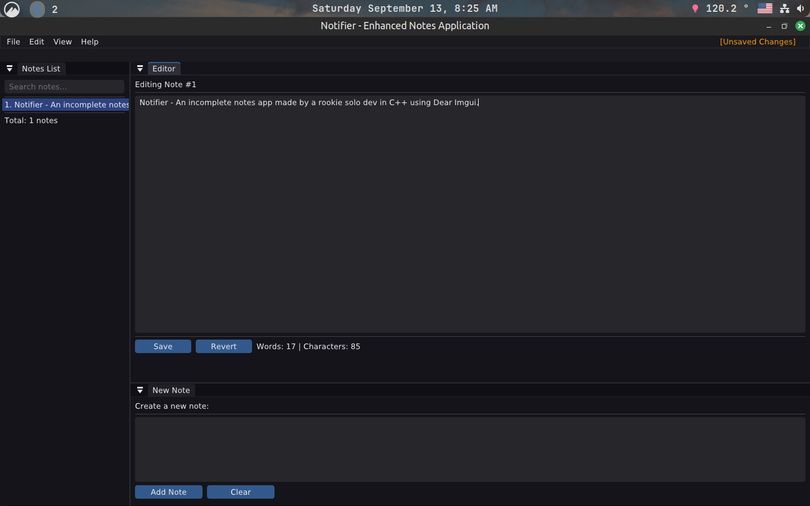
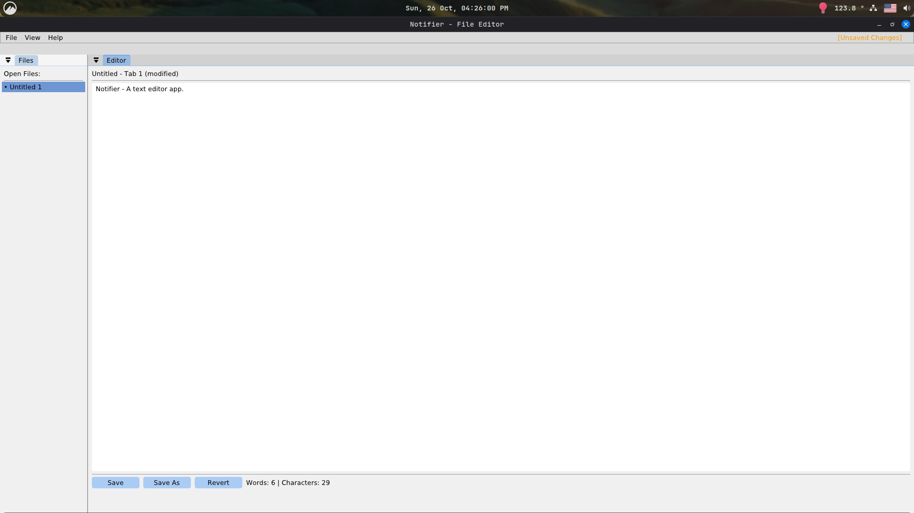

# Notifier — A Notes Application

A lightweight, dockable, cross-platform notes application built with **C++**, **Dear ImGui (docking branch)**, and **GLFW/OpenGL**. Designed for fast note-taking, searching, and quick editing. This repository contains the core app (Notifier v1.0), with a polished UI, keyboard shortcuts, dockable panels, and persistent layout and notes storage.

I suggest you to overwrite the imgui.ini layout file in your own build directory with the layout provided in the resources directory if docking is weird for you **(This is optional)**.

> **Status:** Working — feature-complete for core functionality. Theme/background improvements planned (see Roadmap).

---

## Features

* Dockable UI using Dear ImGui docking branch (tabs, split panels)
* Left resizable **Notes List** (searchable, selectable, context menu)
* Center **Editor** with multiline editing and simple stats (words/characters)
* Bottom **New Note** panel for quick creation
* Keyboard shortcuts: `Ctrl+N`, `Ctrl+S`, `F5`, `Del`, `Esc`
* Persistent notes saved to `notes.txt` (with a per-note delimiter for multiline notes)
* Persistent ImGui dock/layout state (via ImGui `.ini` file)
* Theme support: Dark / Light / Custom (customizable colors)
* Context menus, confirmation dialogs, and modest UX polish

---

## Screenshot

Custom Theme by default

### Custom Theme


### Dark Theme


### Light Theme


---

## Quick Start (Linux Mint / Ubuntu)

(Windows instructions not included — I mainly use Linux, and my PC can’t currently handle a Windows build.I'm sure it will work on windows with a few adjustments PRs welcome!)

### Install build dependencies

```bash
sudo apt update
sudo apt install -y build-essential cmake git pkg-config libglfw3-dev libglm-dev libx11-dev libxrandr-dev libxinerama-dev libxcursor-dev libxi-dev libasound2-dev libpulse-dev libudev-dev libdbus-1-dev
```

> If you prefer, install additional GL loader libraries (e.g. `libglew-dev`) if your CMake setup needs them.

### Clone ImGui (docking branch)

The project relies on the **docking** branch of Dear ImGui to use the DockBuilder APIs.

```bash
git clone https://github.com/ocornut/imgui.git external/imgui
cd external/imgui
git fetch origin
git checkout docking
```

### Build the app (example CMake)

A minimal `CMakeLists.txt` should find GLFW and your ImGui backend. A simple workflow:

```bash
mkdir -p build && cd build
cmake ..
make -j$(nproc)
./notifier
```

*(If your project already contains `CMakeLists.txt`, use it — the app was developed with CMake in mind.)*

---

## Project Layout / Key Files

* `main.cpp` — main application, UI rendering, app state and logic.
* `imgui/` (external) — Dear ImGui (docking branch) and backends (or use submodule)
* `backends/` — `imgui_impl_glfw.cpp`, `imgui_impl_opengl3.cpp` (from ImGui examples)
* `fonts/` — optional custom fonts (e.g. `EpundaSans-Light.ttf`)
* `notes.txt` — user notes stored (created at runtime)
* `notifier_layout.ini` (optional) — saved ImGui layout file (if configured)

---

## Notes storage format

Notes are stored in a simple text format where each note is a block of text, separated by a delimiter line:

```
<note text (can contain newlines)>
--------------
<next note text>
--------------
```

---

## Important Implementations left to add

### 1. Docking and layout persistence

* Use the docking branch of Dear ImGui for `DockBuilder*` APIs and `ImGui::DockSpace` features.
* Set a custom ImGui ini filename to persist layout in a controlled place:

```cpp
ImGui::CreateContext();
ImGuiIO& io = ImGui::GetIO();
io.IniFilename = "notifier_layout.ini"; // or full path in config dir
```

* Initialize your dockspace as a fullscreen parent window and call `DockBuilder` only on first run (or when no layout exists) so that user rearrangements are preserved on next start.

### 2. Fonts

Load a custom font (if present), and fall back to `AddFontDefault()` otherwise. Example:

```cpp
if (std::filesystem::exists(fontPath)) {
    ImFont* mainFont = io.Fonts->AddFontFromFileTTF(fontPath, 16.0f);
    io.FontDefault = mainFont;
}
```

### 3. Input safety

When using `isspace()` or other `ctype.h` functions, cast the argument to `unsigned char` to avoid UB with negative `char` values:

```cpp
if (isspace((unsigned char)ch)) { ... }
```

### 4. Large text buffers vs. `std::string`

The app uses fixed-size char buffers (8k) for `InputTextMultiline`. This works, but you may later switch to `std::string` + `InputText` callback for dynamic resizing.

### 5. Config directory

I am considering saving `notes.txt` and the layout `.ini` to an OS config directory rather than the working directory (e.g. `$XDG_CONFIG_HOME/notifier/` or `~/.config/notifier/`).By using `std::filesystem` to create directories.

---

## UX & Visual Improvements (Roadmap)

### What I plan to add maybe someday

* **Static background image** + subtle gradient tint and vignette.
* **Parallax** based on mouse position for depth.
* Use a **soft radial vignette mask** to focus the UI center.

### Medium

* **Animated gradient** (slow color shifts) for a living UI.
* **Pre-blurred background** for glassmorphism (cheap approach).

### Advanced

* **Runtime Gaussian blur** (FBO + separable blur shader) to blur the area behind panels.
* **Particles / bokeh** subtle motion for polish.

---

## Troubleshooting

* **Buttons not clickable in docked windows:** make sure the dockspace host window doesn’t consume input or draw an opaque background. Use a fullscreen host window for the dockspace and set appropriate flags. Avoid `ImGuiWindowFlags_NoInputs` on the host if you want menus to be clickable inside it.

* **DockBuilder functions not found:** verify that you are using the **docking** branch of Dear ImGui and included `imgui_internal.h` only when necessary.

* **Fonts not loading:** confirm font path and file permissions. Consider bundling fonts under `fonts/` and using relative paths.

---

## Contributions

Contributions, PRs, and suggestions are welcome. If you add features, please:

* Keep ImGui usage idiomatic and avoid heavy per-frame allocations
* Respect the existing `notes.txt` delimiter format (or migrate to JSON with a clear migration path)
* Add tests for parsing and saving notes if you add more complex storage formats
* Feel free to tinker and suggest ideas or improvements to me, would mean a lot.

---

## License & Credits

* This project builds on:

  * [Dear ImGui](https://github.com/ocornut/imgui) (docking branch) — MIT-style license
  * [GLFW](https://www.glfw.org/) — zlib/libpng license

Credits: 
        Safal — original developer and UI designer of Notifier(I also used chatgpt and claude for this LOL!).

---