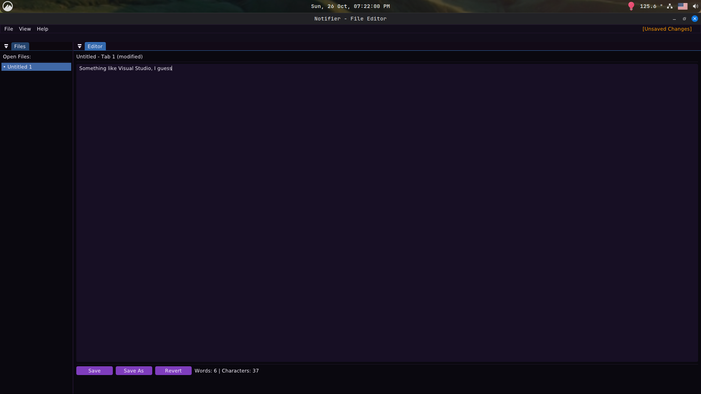
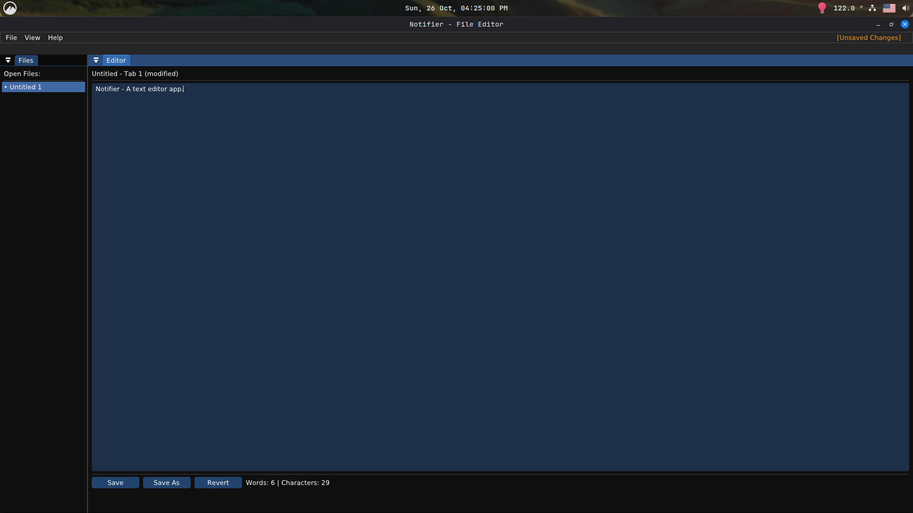

# Notifier — A Text Editor Application

A lightweight, dockable, cross-platform editor application built with **C++**, **Dear ImGui (docking branch)**, **GLFW/OpenGL** and **stb/stb_image**. Designed for quick editing. This repository contains the core app (Notifier v1.0.x), with a polished UI, keyboard shortcuts, dockable panels, and persistent layout.

I suggest you to overwrite the imgui.ini layout file in your own build directory with the layout provided in the resources directory if docking is weird for you **(This is optional)**.

> **Status:** Working — feature-complete for core functionality. Improvements and extra features planned
---

## Features

* Dockable UI using Dear ImGui docking branch (tabs, split panels)
* Center **Editor** with multiline editing and simple stats (words/characters)
* Keyboard shortcuts: `Ctrl+N`, `Ctrl+S`, `F5`, `Del`, `Esc`
* Persistent ImGui dock/layout state (via ImGui `.ini` file)
* Theme support: Dark / Light / Custom (customizable colors)
* Context menus, confirmation dialogs, and modest UX polish

---

## Screenshot

Custom Theme by default

### Custom Theme


### Dark Theme


### Light Theme


---

## Quick Start (Linux Mint / Ubuntu)

(Windows instructions not included — I mainly use Linux, and my PC can’t currently handle a Windows build.I'm sure it will work on windows with a few adjustments, **PRs welcome!**).

### Install build dependencies

```bash
sudo apt update
sudo apt install -y build-essential cmake git pkg-config libglfw3-dev libglm-dev libx11-dev libxrandr-dev libxinerama-dev libxcursor-dev libxi-dev libasound2-dev libpulse-dev libudev-dev libdbus-1-dev
```

> If you prefer, install additional GL loader libraries (e.g. `libglew-dev`) if your CMake setup needs them.

### Clone ImGui (docking branch)

The project relies on the **docking** branch of Dear ImGui to use the DockBuilder APIs.

```bash
git clone https://github.com/ocornut/imgui.git resources/imgui
cd resources/imgui
git fetch origin
git checkout docking
```

### Build the app (example CMake)

A minimal `CMakeLists.txt` should find GLFW and your ImGui backend. A simple workflow:

```bash
mkdir -p build && cd build
cmake ..
make -j$(nproc)
./notifier
```

*(If your project already contains `CMakeLists.txt`, use it — the app was developed with CMake in mind.)*

---

## Project Layout / Key Files

* `main.cpp` — main application, UI rendering, app state and logic.
* `imgui/` (external) — Dear ImGui (docking branch) and backends (or use submodule)
* `backends/` — `imgui_impl_glfw.cpp`, `imgui_impl_opengl3.cpp` (from ImGui examples)
* `fonts/` — optional custom fonts (e.g. `EpundaSans-Light.ttf`)

---

## Implementations adding list

### 1. Find files, text, etc.
I plan to add this in the near future

---

## Troubleshooting

* **Buttons not clickable in docked windows:** make sure the dockspace host window doesn’t consume input or draw an opaque background. Use a fullscreen host window for the dockspace and set appropriate flags. Avoid `ImGuiWindowFlags_NoInputs` on the host if you want menus to be clickable inside it.

* **DockBuilder functions not found:** verify that you are using the **docking** branch of Dear ImGui and included `imgui_internal.h` only when necessary.

* **Fonts not loading:** confirm font path and file permissions. Consider bundling fonts under `fonts/` and using relative paths.

---

## Contributions

Contributions, PRs, and suggestions are welcome. If you add features, please:

* Keep ImGui usage idiomatic and avoid heavy per-frame allocations.
* Add tests for parsing and saving notes if you add more complex storage formats.
* Feel free to tinker and suggest ideas or improvements to me, would mean a lot.

---

## License & Credits

* This project builds on:

  * [Dear ImGui](https://github.com/ocornut/imgui) (docking branch) — MIT-style license
  * [GLFW](https://github.com/glfw/glfw) — zlib/libpng license
  * [STB_IMAGE](https://github.com/nothings/stb/blob/master/stb_image.h) — MIT-style license
---
